# Projeto `The Gargamaze`

* Projeto Final de POO

# Descrição Resumida do Projeto/Jogo

> O propósito do jogo é a captura dos dois cristais principais para que consigam ganhar. Contudo, para isso, os jogadores precisam de habilidades que são adquiridas através da captura de outros cristais que ficam localizados no cantos do mapa, mas para isso precisam vencer desafios em um labirinto com pouca visibilidade e correr contra o seu pior inimigo: O tempo de duração de suas baterias. Além disso, no centro do mapa se encontra um buraco negro que distorce a passagem do tempo aos seus arredores, por conta disso, quanto mais longe do buraco negro os jogadores se encontram mais rapido suas baterias são descarregadas, e quando os jogadores entram no buraco negro, suas baterias são recarregadas. 

# Equipe
* `Thiago Máximo Pavão `           - `247381`
* `Kevin Caio Marques dos Santos ` - `247218`

# Arquivo Executável do Jogo
>[Download](https://drive.google.com/file/d/138DYyCo_OWfGWI8gYvdxZ3F5L54VvRnI/view?usp=sharing)

# Slides do Projeto

## Slides da Prévia
> [Prévia](https://docs.google.com/presentation/d/1mAtWsCDGBxF7lj8pcSTOYw43ReE8C6TG7_TtIIiZnzM/edit?usp=sharing)

## Slides da Apresentação Final

> [Apresentação Final](https://docs.google.com/presentation/d/1Nq9iXtoOGGFCMYAOnZVzsHJ7h0_kNV516n9Oh6eqHng/edit?usp=sharing)

# Relatório de evolução

Inicialmente o projeto começou com uma estrutura base, apenas dois jogadores recebendo comandos do teclado e pedindo para o espaço movimentá-los pelas células, e nesse ponto já existia uma interface gráfica.

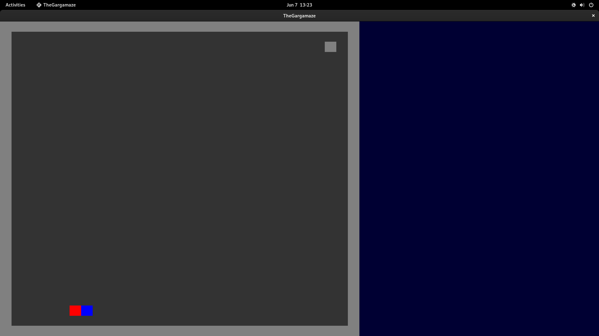

A partir disso acrescentamos a leitura de um arquivo .txt para a criação do labirinto em si. Nesse ponto surgiram algumas dúvidas e decisões importantes precisaram ser tomadas, como a de como representaríamos os elementos no arquivo, e além disso, tínhamos a intenção de que algumas partes do labirinto, como o centro e as paredes laterais, fossem sempre iluminadas. Optamos então por ter dois mapas em um mesmo arquivo .txt, um com os elementos e outro que mostrava somente quais teclas sempre seriam iluminadas. Nesse momento decidimos também como representar os botões e os seus respectivos portões que abrem, e foi decidido que, como não seriam muitos, essa informação seria passada através de coordenadas. Na hora dessa implementação algumas decisões erradas foram tomadas de modo que seria necessário fazer um downcasting, por isso tivemos que fazer algumas alterações na lógica de leitura.

Com a implementação de muitos elementos no jogo que tinham que se comunicar com outros, vimos a necessidade de acrescentar mais interfaces específicas de modo que seria possível essa comunicação mas também ela seria controlada e organizada.

Uma dificuldade enfrentada foi na implementação da interface gráfica, uma vez que teríamos uma quantidade razoável de texturas possíveis que deveriam ser mostradas em uma única célula. Uma solução encontrada foi a criação de uma matriz de células do view, cujas células comunicam-se com as células nas quais os elementos se encontram e com isso descobrem quais texturas devem ser exibidas no momento. E para minimizar a quantidade de texturas carregadas, elas foram carregadas somente uma vez como atributos estáticos de modo que todas as células do view tinham acesso a ela.

# Destaques de Código

Um dos destaques do nosso código seria a implementação da lanterna, usada para iluminar o mapa. Ela foi implementada para promover a iluminação em lugares específicos que queríamos que fossem iluminados, como as bordas, o centro, os cristais e os jogadores, enquanto que o resto do mapa fica escuro.

```Java
private void buildMaze() throws AssembleError {
    ...
    // Criação das lanternas dos cristais
    Lantern lantern = new Lantern();
    lantern.connect(crystal);
    lantern.connect(space);
    crystal.connect(lantern);
    space.addLantern(lantern);
    ...
}
```

Codigo criação do cristal do player

Codigo Array de Ilantern do space

```Java
public class Space implements ISpace {
    
	private Array<ILantern> lanterns = new Array<ILantern>();
    ...
}
```

Codigo Iluminacao da lanterna

```Java
public class Lantern implements ILantern {
    private ISpaceIluminate space;
    private IPosition element;
    ...
    public void iluminate() {
    	...
    	for(int dx = -radius;dx <= radius;dx++) {
    		for(int dy = -radius;dy <= radius;dy++) {
    		...
    		space.iluminate(getX() + dx, getY() + dy, clarity);
    		}
    	}
    }
    ...
}
```

Outro destaque é a forma como os as imagens são dispostas na tela, com o uso da sobreposição de imagens para evitar a criação de imagens para casos muito específicos. Por exemplo, em um caso em que um dos jogadores entra na frente dos botões, em uma mesma renderização é desenhado primeiro o botão e depois o jogador. E isso é feito com o uso de um array de texturas de uma mesma célula, um array com todas as texturas em ordem de prioridade é enviada para o view, responsável por desenhá-las na tela.

Codigo de texturas 1

```Java
public void update() {

    int nbElements = cell.nElements();
    
    textures.clear();
    textures.add(imgGround);
    
    if(!cell.visible()) }
    	textures.add(imgDark);
    ...
    else {
		for(int i=0;i < nbElements;i++){
			if(cell.visual(i).type() == 'B') {
				if(cell.visual(i).variation() == 'C') {
					if(cell.visual(i).state() == 'p') {
						textures.add(imgButtonPressedFrame);
						textures.add(imgBlueBG);
						textures.add(imgButtonPressed);
					}
				}
			...
			}
			else if(cell.visual(i).type() == 'P') {
				...
			}
		}    
    }
    ...
}
```

Codigo de texturas 2

``` Java
private void drawMap() {
	batch.begin();
	
	for(int x=0;x < size;x++){
			for(int y=0;y < size;y++){
				batch.setColor(1f,1f,1f,1f);
				ViewCell aux = cells[x][y];
				
				for(Texture texture: aux.getTexture()) {
					batch.draw(texture, aux.getX(), aux,getY(), ViewCell.size, ViewCell.size);
				}
				...
			}
	}
	batch.end();
}
```

Outro destaque é o controle do tempo de vida dos jogadores dependendo da posição em que este se encontra no mapa, quanto mais longe do buraco negro mais rápido o tempo passa. Essa implementação se alinha com a ideia do jogo, o buraco negro que se encontra no centro é o responsável por controlar essa variação do tempo.

Codigo do tempo buraco negro

```Java
public class Blackhole implements IUpdate, ITime, IVisualBH {
	...
	private IPlayerBH pCase, pTars;
	...	
	public void update() {
	   posCase = pCase.getIPosition();
	   posTars = pTars.getIPosition();
	   boolean caseIn = inside(posCase);
	   boolean tarsIn = inside(posTars);
	    
	   if(caseIn)
	       incCase = 20000;
	   else
	       incCase = - (float) distanceFactor(posCase);
	    
	   if(tarsIn)
	       incTars = 20000;
	   else
	       incTars = - (float) distanceFactor(posTars);
	   ...
	}
	...
	public void update(float t) {
        pCase.updateTimeRemaining(t * incCase);
        pTars.updateTimeRemaining(t * incTars);
    }	

```

Outro destaque é que o mapa é criado com base em um arquivo .txt. Por isso, o mapa pode ser criado em vários tamanhos e com diversas variações de puzzles e desafios, bastando somente alterar o .txt.

Código do Builder

```Java
public class Builder {
	private void readFile() throws IOException {
		FileHandle handle = Gdx.files.internal(mazePath);
		...
		readMazeMatrix(lines);
		...
		readVisibilityMatrix(lines);
		...
		readButtons(lines);
	}
}
```


# Destaques de Orientação a Objetos

## Diagrama de Classes Usado no Destaque de OO

## Código do Destaque OO


Polimorfismo

```Java
public class Cell implements ICell{
    private Array<Element> elements = new Array<Element>();
    ...
    public void insert(Element toInsert) {
    	elements.add(toInsert);
    	toInsert.setCell(this);
    	viewCell.update();
    }
    public void remove(Element toRemove) {
    	elements.removeValue(toRemove, true);
    	toRemove.setCell(null);
       viewCell.update();
    }
    ...
 }
```

Interfaces

```Java
public class Player extends Element implements IPlayer {
	...
	@Override
	public void moveLeft(){
	...
	}
	...
	@Override
	public void dropCrystal(){
	...
	}
} 
```

```Java
public interface IPlayer extends    ICommand, ITime, IVisualPlayer, 
                                    IPlayerInteraction, IPlayerSwitchHability, IPlayerBH {

}
```

```Java
public interface ICommand {
	public void moveLeft();
	public void moveRight();
	public void moveUp();
	public void moveDown();
	public void moveTo(int x, int y);
	public void commandAction();
	public void commandDeaction();
	public void useHability(int i);
	public void dropCrystal();
}
```


# Destaques de Pattern

## Diagrama do Pattern
## Código do Pattern

Facade: Usado na criação do jogo

```Java
public class AppTheGargamaze extends Game implements IGame {

	public void createTutorial() {
         Builder bob = new BuilderTutorial(this);
         
         try {
             bob.build();
         }
	...
	}
	public void createGame() {
		 Builder bob = new Builder(this);
		 try {
			 bob.build();
		 }
	...
	}	 
}
```

```Java
 public void build() throws AssembleError {
		try{
			readFile();
		}
		catch(Exception IOException){
			throw new AssembleError("Error while building map.");
		}
		
		space = new Space();
		space.setAlwaysVisibleCells(visibilityMatrix);
		createView();
		connectCells();
		createControl();
		
		// Monta o mapa
		buildMaze();
		buildButtons();
		
		// Cria Habilidades
		createHability(0);  // Habilidade Visual
		createHability(1);  // Habilidade troca de lugar.
		createHability(2);  // Habilidade atravessar paredes
		
		// cria lanternas
		createLantern(pCase);
		createLantern(pTars);
		
		// Cria Buraco negro
		createBlackhole();
       ...
    }
```
Observer: Habilidades disponíveis e no View

```Java
public abstract class Hability implements IHability{
	public void update(float t) {
        ...
        if(time < 0) {
            if(onCooldown) {
                onCooldown = false;
                time = 0;
            }
            else if(isRunning)
                removeEffect();
        }
    }
}
```
```Java
public class ViewCell implements IUpdate {
	public void update() {
		...
		textures.clear();
		textures.add(imgGround);
		...

	}
}
```


# Conclusão e trabalhos futuros

# Diagramas

## Diagrama Geral da Arquitetura do Jogo

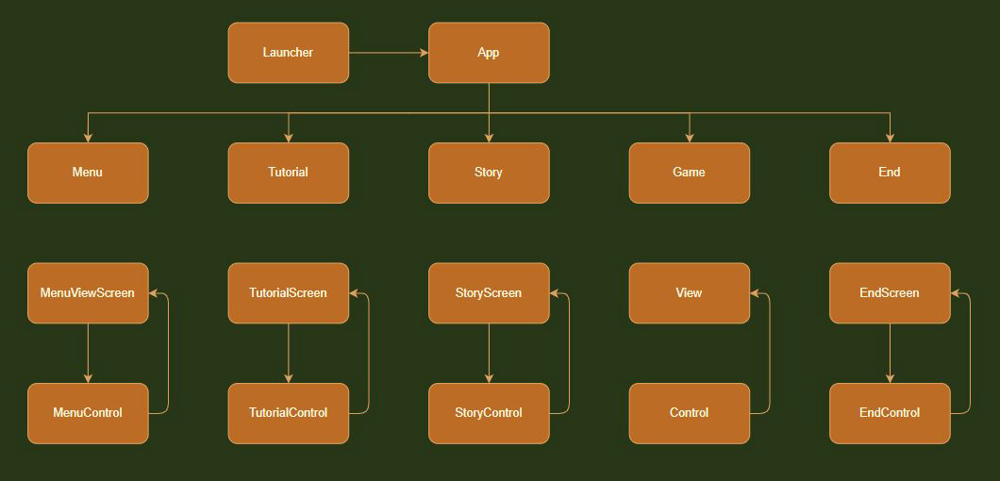

Utilizamos o framework libgdx, que força o uso de uma certa estrutura para o jogo, primeiramente temos os Launcher, classe responsável por inicializar o jogo e criar um objeto da classe App. Esta classe é responsável por gerenciar as telas do jogo, como o menu inicial, tela de história e a tela da partida (este nome se refere à tela em que realmente o jogo ocorre, onde os jogadores tem controle dos personagens e seus objetivos a cumprir).

Utilizamos o padrão de arquitetura MVC, no diagrama está representado a classe responsável pela visualização e a de controle de cada estágio do jogo. A comunicação entre estes objetos quando dentro da partida também inclui o model, que será detalhado no próximo diagrama.

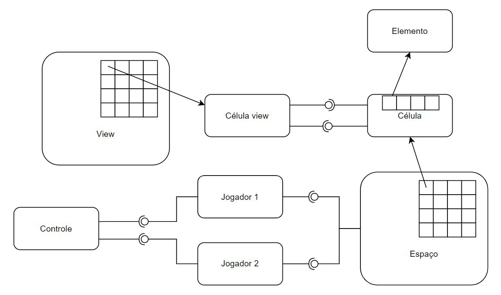

Como é possível ver no diagrama, o funcionamento da partida é intuitivo. O Controle se comunica com os Jogadores, para informá-los das ações e movimentos que devem ser tomados, em seguida os Jogadores se comunicam com o Espaço, que possui uma matriz de Células. Cada Célula é conectada à uma Célula view, responsável por auxiliar o View na impressão do jogo na tela. 

Os jogadores, assim como todos os elementos no mapa, como botões, paredes e cristais, são herdeiros da classe abstrata Elemento, e cada Célula armazena uma lista de Elementos, e portanto, a comunicação da Célula com os elementos dentro dela é completamente polimórfica.

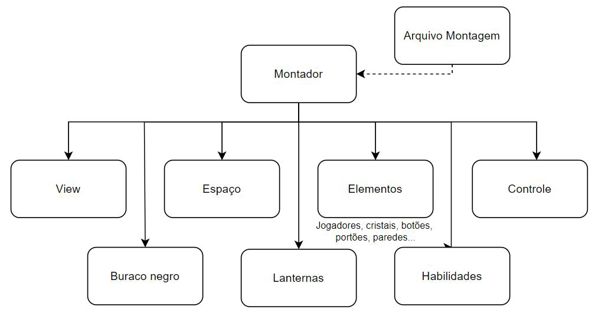

Como será visto à frente, existem muitas conexões entre diversos componentes do jogo, por interfaces. Essa conexões são feitas pelo Montador, classe responsável por instânciar cada objeto essencial para o funcionamento do jogo e conectá-los.

## Diagramas Gerais dos Componentes

Agora será detalhado as funcionalidades gerais de alguns aspectos da partida.

### Controle dos Jogadores

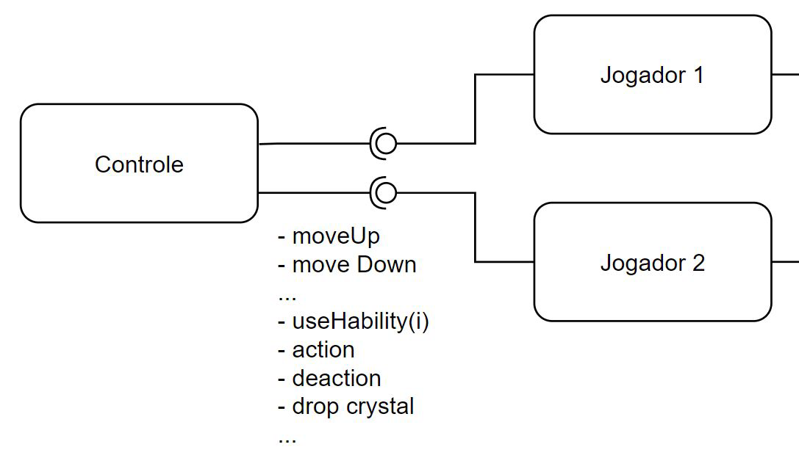

O controle recebe os comandos do teclado, e é responsável por por chamar os métodos corretos para cada jogador, à depender da tecla pressionada.

### Comunicação dos Jogadores com o Espaço

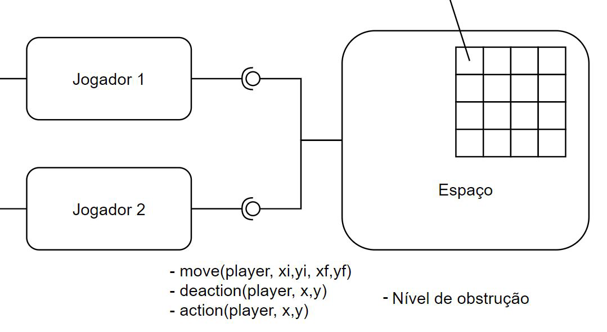

Após receber a informação de movimentação do controle, os jogadores pedem ao espaço para realizar o movimento para a célula especificada, o espaço é responsável por verificar se este movimento é possível, o que foi feito atráves do conceito de nível de obstrução.

Cada elemento tem como atributo um nível de obstrução. O nível de obstrução de uma Célula é dado pelo maior nível de obstrução dos elementos dentro dela. Dessa forma, o espaço só permite que o movimento seja feito quando o nível de obstrução da célula-alvo é menor ou igual à 1. O nível de obstrução de paredes e portões, por exemplo, é 2, e portanto o jogador não é capaz de andar para células que contenham um destes elementos.

O nível de obstrução 1 apenas impede que cristais sejam inseridos na célula, o que faz com que não seja possível inserir dois cristais na mesma célula, dado que o nível de obstrução de um cristal também é 1.


### Interface Visual Geral

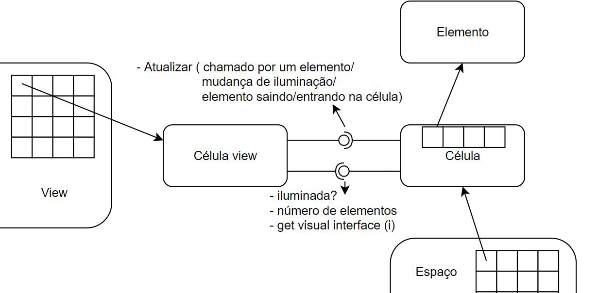

Cada Célula está conectada à sua Célula view correspondente, e é responsável por avisá-la de qualquer alteração que ocorra nela, como de iluminação ou dos elementos que ela contém (padrão de observer). Quando avisada de que ocorreu alguma modificação, a Célula view é responsável por se atualizar, perguntando à Célula, qual seu estado, percentual de iluminação e quais Elementos estão presentes nela. 

Com isso, a Célula view monta uma lista de texturas que compõe a imagem daquela célula. Por fim, o View utiliza esta lista para sobrepor a imagem na tela, na posição correta. Dividindo as ações mais gerais e específicas de forma simples.


### Iluminação do mapa

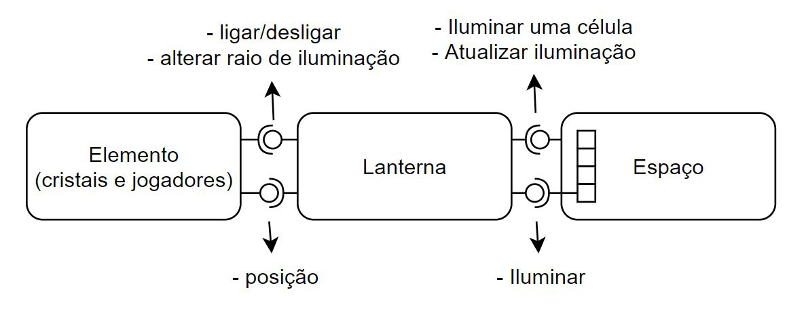

A iluminação do mapa mapa é feita através de objetos da classe Lanterna. Cada célula conta com um atributo booleano de visibildade, o espaço é capaz de informar uma célula se ela precisa estar iluminada ou não, assim, cada vez em que ocorre um evento de mudança de iluminação do mapa, como um movimento de um jogador ou o uso de uma habilidade de aumento de raio de visão, o espaço é responsável por escurecer o mapa por completo, e chamar cada lanterna para iluminar a região que ela é capaz de iluminar.

A lanterna por sua vez está sempre conectada à um elemento através de uma interface de posição, dessa forma, quando chamada pelo espaço para iluminar, ela é capaz de saber quais são as posições que devem ser iluminadas. Essas posições são informadas de volta ao espaço, que é responsável, por fim, de avisar as células nas posições indicadas.

O elemento também pode contar com uma referência opcional para sua lanterna, para poder alterar certos parâmetros desta, como o raio de iluminação.

Por fim, além de avisar ao espaço quais células devem ser iluminadas, a lanterna também informa um valor percentual da quantidade de iluminação da célula, o que possibilita o degradê de iluminação presente no jogo.

### Habilidades

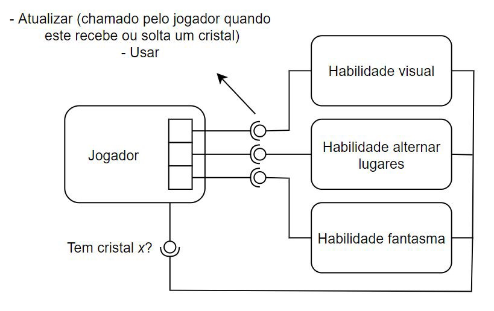

Cada habilidade é herdeira de uma classe abstrada que contém o funcionamento geral de uma habilidade, composto da lógica de atualização de tempo, por exemplo na atualização da passagem do tempo de cooldown, a lógica de desbloqueio da habilidade e de uso. Cada habilidade conta com uma interface de comunicação com o jogador, para poder perguntar se este têm o cristal necessário para desbloquea-la. O jogador por sua vez é responsável por avisar a habilidade sempre que ocorre uma mudança nos cristais de seu inventário.

Por fim, o jogador é capaz de usar qualquer habilidade de forma polimórfica, apenas com o uso do método .use() implementado por qualquer habilidade.

O funcionamento interno de cada habilidade varia, e será detalhado em seguida

__Habilidade Visual__

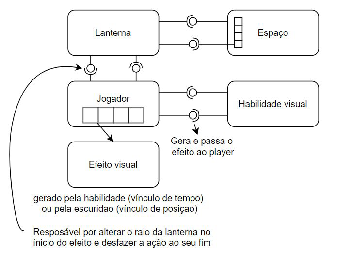

Como explicado na seção de iluminação do mapa, cada elemento pode conter uma referencia por interface para sua própria lanterna. A habilidade nesse caso é responsável por criar efeitos das classe EfeitoVisual, que são passados ao jogador. Um efeito visual tem uma duração e uma variação no raio de visão, cada vez que um jogador recebe um novo efeito, ele aplica a variação especificada no seu raio de visão. Assim, a habilidade é apenas responsável por gerar um efeito e passá-lo ao jogador. 

Os elementos no espaço também são capazes de interagir com o jogador e passar efeitos visuais, isso é feito pelas regiões mais escuras no mapa, ao interagir com elas, o jogador recebe um efeito visual de variação negativa no seu raio de visão.

__Habilidade Trocar de lugares__

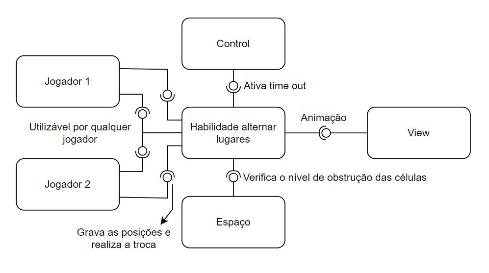

A habilidade de trocar os lugares dos jogadores é a mais estruturalmente complexa, primeiramente, ela possui uma referencia aos dois jogadores, o que a difere das outras que somente possuem referência ao jogador que a possui. Esta dupla referência é necessária pois a habilidade somente deve ser desbloqueada caso os dois jogadores tenham o cristal necessário.

Ao ser utilizada, a habilidade é responsável por verificar se a troca pode ser feita com segurança, garantindo que a troca não seja feita por exemplo quando um dos jogadores está atravessando uma parede. Para isso ela conta com uma referência do Espaço.

Caso a habilidade possa ser utilizada com segurança, ela desativa o Controle de jogo pelo tempo necessário para a execução, para que os jogadores não realizem comandos enquanto ocorre a troca, ela também avisa o View de que a animação de troca se realizará e também gerencia o progresso da animação. Por fim, por meio da mesma interface utilizada na comunicação dos jogadores com o controle, ela avisa cada jogador qual sua nova posição.

__Habilidade Fantasma__

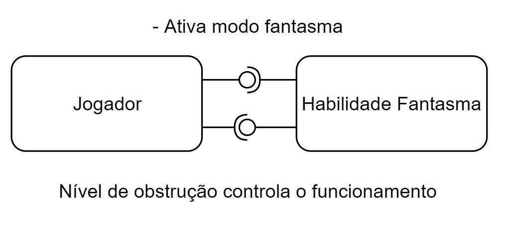

Esta é a habilidade de implementação mais simples, devido à forma que o movimento pelo mapa foi construido. O método de movimentação do Espaço também conta com um atributo *forced*, que informa ao Espaço se o movimento deve ser permitido para o nível de obstrução 3. Quando a habilidade é utilizada, ela apenas informa o jogador de que agora ele tem direito de passar esse parâmetro como verdadeiro.

É importante notar que existem também elementos de nível de obstrução maior que 3, que possibilita a criação de regiões	não podem ser alcançadas mesmo com esta habilidade ativa.

### O tempo

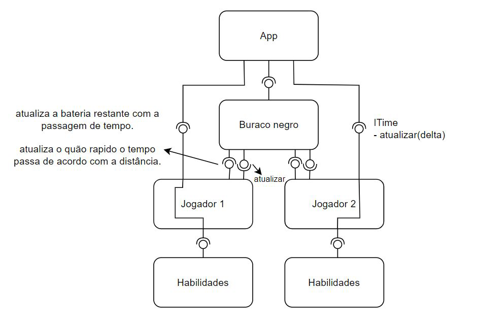

No método de renderização do libgdx, podemos obter o valor do tempo de renderização do frame anterior. Este valor é passado para o Buraco negro, jogadores e para o controle. O Buraco negro é responsável por calcular o fator de multiplicação desse tempo para cada jogador, que altera com a distância de cada um deles ao buraco negro, após o cálculo, o Buraco negro informa aos jogadores quanto tempo eles devem atualizar de sua vida. O Buraco negro também informa aos jogadores para regenerar a vida quando eles estão dentro dele.

O tempo de renderização do frame também é passado aos jogadores, qua repassam este tempo para cada uma de suas habilidades e seus efeitos visuais. A forma que este tempo é processado é única a depender do objeto que o recebeu.

Por fim, este tempo também é informado ao Controle, como visto na Habilidade de trocar de lugares, o controle oferece um método *time out*, este método recebe apenas um parâmetro: a duração que os comandos recebidos pelo teclados devem ser ignorados. Por isso, o Controle também precisa receber a informação de passagem de tempo. 

### Finalização da Partida

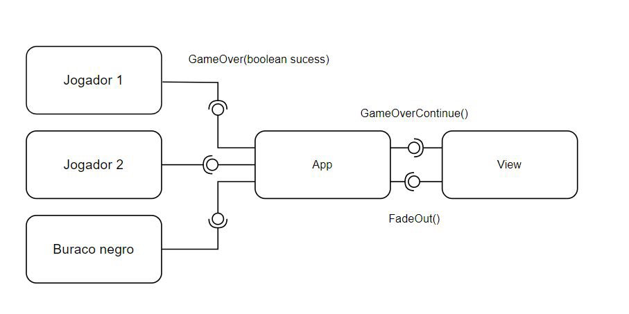

O fim do jogo ocorre quando um dos jogadores fica sem bateria ou quando os dois jogadores conseguem entregar os dois cristais finais ao buraco negro. Cada jogador é responsável por avisar o App de que o jogo acabou com falha quando seu tempo de vida se esgota. Já o buraco negro monitora se os dois jogadores entraram nele com seus cristais e quando isso ocorre, informa o App de que o jogo terminou com sucesso.

O App registra o fim de jogo e avisa o View para começar a animação de Fade Out, quando o fade termina o View avisa o App para continuar. Nesse ponto, o App cria a tela de fim de jogo de acordo com o parâmetro de sucesso ou falha que foi registrado.

# Componentes

## Componente `Jogador`

O jogador é um dos componentes centrais do jogo, sendo responsável por gerenciar tudo que diz respeito a um dos jogadores: suas habilidade, seu inventário, seu estado e o tempo de vida restante.

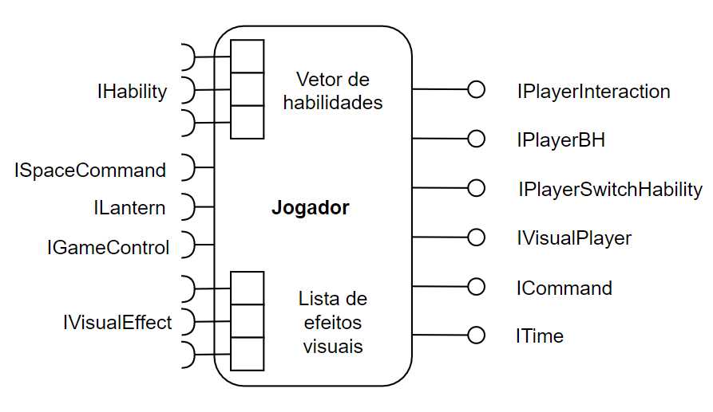

**Ficha Técnica**

item | detalhamento
----- | -----
Classe | `com.mygdx.game.elements.player.Player`
Interfaces  <br />providas| `IPlayerInteraction`, <br /> `IPlayerBH`,  <br /> `IPlayerSwitchHability`,  <br /> `IVisualPlayer`, <br /> `ICommand`, <br /> `ITime`

### Interfaces

Interfaces associadas a esse componente:

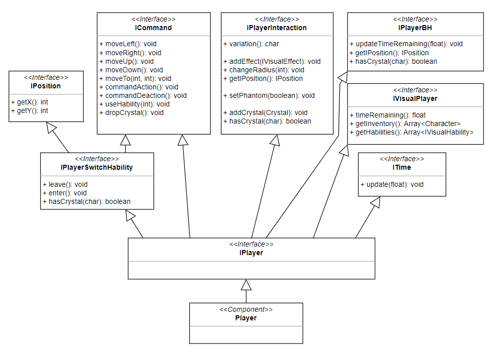

Interface agregadora do componente em Java:

```java
public interface IPlayer extends ICommand, ITime, IVisualPlayer, IPlayerInteraction, IPlayerSwitchHability, IPlayerBH {

}
```

## Detalhamento das Interfaces

### Interface `ICommand`

Interface utilizada pelo Controle para requisitar ações aos jogadores

```java
public interface ICommand {
	public void moveLeft();
	public void moveRight();
	public void moveUp();
	public void moveDown();
    public void moveTo(int x, int y);
	public void commandAction();
	public void commandDeaction();
	public void useHability(int i);
	public void dropCrystal();
}
```

### Interface `ITime`

Interface de comunicação de passagem de tempo pelo App, nessa chamada o jogador avisa à todos os outros componentes conectados a ele, e que precisam saber da passagem de tempo, sobre a ela.

```java
public interface ITime {
    public void update(float t);
}
```

### Interface `IVisualPlayer`

Interface visual do jogador, oferece todos os métodos necessários para o View mostrar as informações necessárias na tela, como o tempo restante de bateria, o inventário e o estado de cada umas das habilidades.

```java
public interface IVisualPlayer {
    public float timeRemaining();
    public Array<Character> getInventory();
    public Array<IVisualHability> getHabilities();
}
```

### Interface `IPlayerInteraction`

Interface de interação do jogador, que oferece métodos de interação com outros elementos, como a a escuridão, e também é a interface utilizada por algumas das habilidade, para realizar o efeito desejado.

```java
public interface IPlayerInteraction {
    public char variation();
    
    public void addEffect(IVisualEffect effect);
    public void changeRadius(int change);
    public IPosition getIPosition();
    
    public void setPhantom(boolean phantom);
    
    public void addCrystal(Crystal c);
    public boolean hasCrystal(char variation);
}
```

### Interface `IPlayerSwitchHability`

Interface da habilidade de trocar os jogadores de lugar, por ser a hablilidade mais complexa, foi necessário criar uma interface somente para oferecer todos os métodos necessitados pela habilidade para seu funcionamento.

Implementa outras duas interfaces, já implementadas pelo Jogador, somente para que a habilidade também tenha acesso aos métodos contidos nelas.

```java
public interface IPlayerSwitchHability extends IPosition, ICommand {
    public void leave();
    public void enter();
    public boolean hasCrystal(char variation);
}
```

### Interface `IPlayerBH`

Interface oferecida para o Buraco negro, para que ele consiga saber a posição deste e atualizar seu tempo restante da maneira desejada. Também conta com o método *hasCrystal*, para conseguir saber se o jogo terminou com vitória e avisar o App.

```java
public interface IPlayerBH {
    public void updateTimeRemaining(float t);
    public IPosition getIPosition();
    public boolean hasCrystal(char variation);
}
```

# Plano de Exceções 

## Diagrama da Hierarquia de Exceções

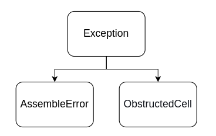

## Descrição das Classes de Exceções

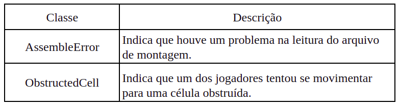